**Digital Twin Security Solution (Dtss) - Securing Industrial Control System(ICSs)**

**With Digital Twin**

Abubakar Abubakar Yusif - 1821881

*Department Of Computer Science, Kulliyyah of ICT, International Islamic University Malaysia [abuyusif01@gmail.com*](mailto:abuyusif01@gmail.com)*

**Abstract**

*Security has always been a point of discussion when it comes to Industrial Control systems(ICSs) as well as Industry 4.0, Considering the nature of their use cases. In recent years, digital twins for industrial control systems have attracted a lot of attention. The increased capabilities of digital twins in the fields of simulation, optimization, and predictive mainte- nance have attracted a lot of interest. Throughout recent research, the use of digital twins for intrusion detection and vulnerability detection in industrial control systems has been greatly highlighted. This project aims to enhance an existing solution. By incorporating extensibi- lity, portability as well as simple lessness to the previous solution. In addition, we also implement a real-time Application Programming Interface (API), capable of detecting, reporting and possibly mitigating intrusions and abnormalities on a network, with the help of a Supervised Machine Learning (ML) trained Model.*

***Keywords— Industrial Control System (ICSs), Machine Learning (ML), Digital Twins (DTs), Intrusion, Vulnerability, Abnormalities, API.***

1. ***Introduction***

The evolution of Industry 4.0 Changed our perspectives on Virtualization and Simulation. By giving us almost a real-world like copies of a system using 3D.

A digital twin replica takes this to the next level by giving us the ability to virtually copy a system functionality just like how it is in real word

as well as analyzing its performance in the real- time (Synchronized) with an unpredictable Input.

Figure 1:  Digital Twin Example

As ICSs become more connected to communica- tional networks, they become more vulnerable to cyberattacks. Due to the sheer importance of the industrial activities handled by these systems, ensuring their security against cyberattacks is critical and should be examined thoroughly. Considering the uniqueness characteristics of those systems, performing penetration testing on certain sorts of systems might be difficult or in some cases Impossible as it might result in disruption of services or sometimes permanently damaging the system, bearing in mind those systems are required to be online at all times, Digital Twin provides more options in terms of computing resources while having no negative influence on the efficiency of running systems. Using DT as a component that allows a system to simulate a physical system in the digital realm in real-time. As a result, security analysis and vulnerability identification using digital twins seem to be an effective way to protect ICSs against cyberattacks.

2. **Related Works**

Prior to Digital twin, there’s no standard way of simulating a synchronized real-time virtualization. Digital Twin solves the simulation and real-time unpredictability of user input letting us design a design based on its physical replica. As a result, all reviewed works are in a way related to Digital twin and virtualization.

A framework has been proposed by Eckhart et al[1] Called CPS Twinning; This framework can automatically generate the digital twin of an ICS using Mininet-WiFi from the specification of the ICS. Two operation modes of the digital twin are supported in this framework, the first one is simulation mode where there is no need for coexistence of the physical system, and the second one is replication mode which supports synchronization with the physical system.

Gehrmann el al [2] proposed a digital twin- based security architecture for IACS, and it mainly focuses on detailing the security requirements for different components of the proposed architecture. It also introduces the concept of an active state replication approach using clock synchronization at regular intervals to achieve synchronization between the physical twin and the digital twin.

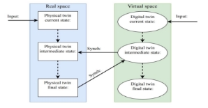

Figure 2: Synchronizing Real System with DT [2]

M Dietz et al[3] Demonstrate the feasibility of integrating digital twin security simulations into the Security Operations Center, the framework he proposed is realized as a microservice architecture using Docker containers. A digital twin implementation using Mininet and MiniCPS is used to achieve security simulation, and security analytics is performed with a Security Information and Event Management module that

uses a rule-based attack detection from system logs.

Seba Anna [4] Proposed a Digital Twin-base Intrusion detection system for Industrial Control Systems, the proposed system uses a supervised Machine Learning to detect a cyber attack on a Network. The project uses docker containers, LogStash with mininet to simulate the chosen Digital twin. In addition, the proposed solution Utilized SIEM to show system Logs in real-time as well as abnormalities if any.

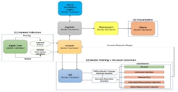

Figure 3: ML-Based IDS [4]

Qinghu et al. [5] Unlike Other proposals, This one the author proposed a solution using generators to detect abnormalities on ICSs with digital Twin. The author presents an approach called Anomaly deTection with digital twin (ATTAIN), which continuously and automatically builds a digital twin with live data obtained from a CPS for anomaly detection. ATTAIN builds a Timed Automaton Machine (TAM) as the digital representation of the CPS, and implements a Generative Adversarial Network (GAN) to detect anomalies.

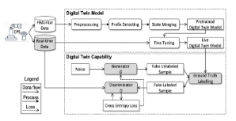

Figure 4: Anomaly Detection with ATTAIN [5]

Philip et al. [6] Envision the SOAR4IoT Framework. Which helps in managing and

Securing IoT using Digital Twin Technology, Furthermore, they Highlighted how complex and extensive it is to secure and maintain an Industrial Control System, due to financial limitations, human errors and the system's usage nature. This work combines IoT security and Digital Twin to achieve a security framework capable of detecting misusing of IoT devices. In Addition, this research demonstrates how easily a destructive botnet can be detected and stopped in nearly real time by utilizing digital twin systems logs.

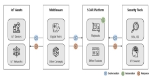

Figure 5: SOAR4IoT Framework Flow [6]

Akbarian et al. [7] Proposed a slightly differe- nt solution compared to what was proposed by Gehrmann et al [2]. Whereas they develop an intrusion detection framework capable of detecting and classifying severity of attacks. The proposed solution used supervised machine learning. The main focus of this research was to create an environment that will be used to patch Industrial Control Systems ICSs without risking damaging the real systems. In addition, the attack classification algorithm they use will categorize data into distinct classes, Support Vector Machine is the machine learning approach they used to train the model. Whilst for the attack Detection, they used an existing solution called Kalman filter. This filter is used to estimate the correct output of the system, the filter allows them to optimally remove the destructive effects of attacks and therefore, removing the noises from compromis- ed systems hence letting them detect an intrus- ion on the network.

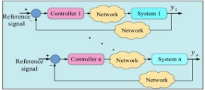

Figure 6 : Target System overview [7]

3. **Methodology**

Considering the nature of this project, we will be using mixed methodologies. Qualitative and Quantitative research methodologies. The first step needed to be carried out is identifying an open-source Digital Twin replica. Secondly, We need to identify an algorithm to train the model. Thirdly, we will be developing an API to ease the communication between log servers, ML models, and the admin dashboard. And finally We will create a Dashboard to represent the data captured from Digital Twin into readable format.

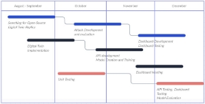

Figure 7: Project Gantt-Chart overview

1. **Design**

The model architecture we chose for this project is the one proposed by M. Eckhart and A. Ekelha [1]. The reason behind choosing this architectural design compared to all others are; The solution was completely open source, it's a standalone application and it perfectly replicates a real-world Industrial Control System ICSs use cases. Table 1.0 shows the comparison between other reviewed solutions.

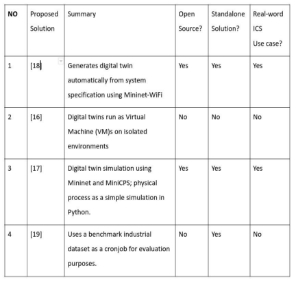

Table 1: DT Proposed Design comparison

Despite selecting the solution proposed by M. Eckhart and A. Ekelha [1]. There are some chan- ges that need to be carried out for enhancement, those changes are API development, Admin Dash- board Development and real time reporting sys- tem. Therefore we maintain the network design and change everything else. Figure 9 is the Initial proposed solution by [1] whilst Figure 10 is the enhanced System that we will be using with this project.

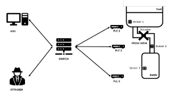

Figure 8: Digital Twin Design  [1]

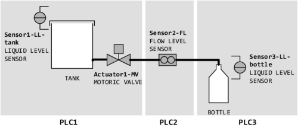

Figure 9: Filling Plant DT prototype [1]

For the simulation part, We will be using a Digital twin replica of an Industrial filling plant. Each PLC reads from a sensor and sends the data to a central Api for analysis and detection. In addition, each PLC saves its logs to a file which is only accessed by admin. The network is built on top of Mininet [8]. This will allow us to have the Digital twin Isolated from the outside world.

Figure 10: Initial system design by [1]

In [1], The authors use docker and kibana to simulate the Network. Each Node represents a single container. whilst for this project, there's no docker containers. Hence everything runs on a standalone Host. In addition, if we take a look at [1] proposed solution, we will see that there’s no API to ease internal and external communication. Lastly, we also add a dashboard which was absent in [1].

Figure 11: Enhanced System design

The API is designed using the python web framework Flask [9] (Grinberg, 2018) with flasgger[10] (flasgger, 2021) used for documentation and local testing, there are a total of 7 routes of GET type request. A more technical explanation and sample of usage can be found on the official github repository of the project [11]. When it comes to easy accessing the dashboard, an online server is a requirement, currently the

API is deployed to DigitalOcean[12] (Yencey et al 2011) allowing inference from anywhere as long as the gateway is available.

|**NO**|**Name**|**R-Type**|
| - | - | - |
|1|get\_status|GET|
|2|plc\_log|GET|
Table 2:  API for Models

The API for Model is used to get the predictions from the ML models. The API is built using Flask and the models are built using scikit-learn  as supervised Machine learning.

The API itself have a total of 2 endpoints which consist of:

1. get\_status: This end point is used to

check the status of Digital Twin state, the route take the following as input parameters:

- tank\_liquidlevel: the liquid level of the tank capture by the sensor
- flow level: sensor value for flow level
- bottle\_liquidlevel: bottle liquid level captured from the sensor
- motor\_status: current status of plc1 motor valve
- model\_name: since we have a total of 5 models, we need to specify which model to use (default rf - random forest).
2. plc\_log: This end point takes only 1

argument which is a file name and returns its content as a json object.

|**NO**|**Name**|**R-Type**|
| - | - | - |
|1|get\_data|GET|
|2|card\_info|GET|
|3.|gen\_table|GET|
Table 3:  API for Internal Logs

This API is mainly used to generate tables for the dashboard. It has the following routes:

1. get\_data: A GET method that takes a single parameter, file\_name, and returns the contents of the specified file location.
1. card\_info: A GET method that takes no parameters and returns a dictionary with the following keys:
   1. network\_count: The number of networks.
   1. network\_percent: The percentage of net- works
   1. injection\_count: The number of injections command line injection retrieved from the database.
   1. injection\_percent: The percentage of co- mmand line injections in comparison with total traffic.
   1. total\_lines: The total number of lines in the log file, we need this to calculate the average of attacks and normal traffic.
1. gen\_table: This endpoint updates every 0.5sec to generate the data we see on the admin dashboard.

|**NO**|**Name**|**R-Type**|
| - | - | - |
|1|get\_vlaue|GET|
|2|set\_value|POST|
Table 4:  API for Internal Communication

The internal communication API serves as a central server for PLC’s. Since we’re using sqlite, we need to find a way to update sensor values in real-time. Therefore, this API sends and receives the latest Tag status from PLC’s. In addition, we detect a Dos when this API is not reachable. The API has a total of 2 endpoints.

1. get\_value: Take a single tag and return the value of it.
1. set\_value: takes e tag, and its value then updates it in the database.

|NO|Name|R-Type|
| - | - | - |
|1|send\_mail|POST|
Table 5: API for notifying admins via email

The final component in this project is the user interface, The admin dashboard is designed using HTML, CSS, JS, the consensus is to have five main screens in the admin dashboard each with a predefined purpose, the main page which shows the current status of the systems, as well as real-time log, A terminal screen which let admin to execute system commands on the host, An event tab which show recent updates in the network as well as alarming admin incase of intrusion detected. An about page which shows information related to current versions of systems and credits. And finally the Settings, which let admin create and manage users.

2. **Model Implementation**

The model is trained and implemented using supervised Machine learning with the help of sklearn[13]. All API’s are implemented using Flask, [9] the python web framework and can be self-hosted on any platform. The instruction to host can be found on the readme page of the project repository.

HTML, CSS and Javascript is the best option when it comes cross platforms, this allows us to write a single code-base and run it on any operating system with a web browser. In addition, Javascript has the API implementation helpers hence utilizing the tools we have at our disposal.

**General Application workflow**

- Periodically check the logs of PLC1, PLC2, and PLC3 Update all relevant databases with the latest log information
- Parse the logs through an intrusion detection model
- Send the results of the model back to the dashboard servers, which are updated every 30 seconds
- PLC1 is responsible for deciding to close the actuator of PLC2 and PLC3 If an intrusion is detected,
- the system will alert the relevant parties and take appropriate action to mitigate the threat in our case its the admin
3. **Dataset Collection**

The dataset was collected by manually monitoring the system logs and labeling the resulting data points. A variety of different types of attacks were then launched on the network and the resulting system logs were added to the dataset.

The resulting dataset was of sufficient size and quality for model training, with a total of 5000 data points. The dataset was preprocessed and cleaned to ensure that it was ready for use in training the models. The dataset was then split into training and test sets, with 80% of the data used for training and the remaining 20% used for testing.

All of the collected dataset can be found on the GitHub page of the project[11]. The dataset includes a variety of different types of attacks and system logs, ensuring that the models trained on this dataset will be robust and capable of handling a wide range of scenarios.

4. **Attack Implementation**

Assuming the adversary knows the specific process of the ICSs, there’s total of 3 different attack categories modeled.

1. Denial of Service: is an attempt by an adversary to flood a server with traffic to overwhelm the service. According to [14] Dos is to be considered the biggest threat of ICSs. This attack is carried on by flooding the internal server with unnecessary traffic, hence leading to service disruption.
1. Command Line Injection: An attack involved in granting an attacker system command execution. In [15] Yao-bin stat- ed that when hackers or unknown threats are attacking ICSs, the first thing they tend to utilize is the command line injection, due to updated or unauthen- ticated protocols used in ICSs.
1. Man In the Middle: ICSs are interconnec- ted systems, Hence they share system status, setting values and updating values with peers in the same network. An

adversary with the right access to the network can easily sniff the traffic and potentially analyze or in worse case be able to modify the traffic.

5. **Testing**

For the frontend, platform compatibility testing should not be something we need to be agonized upon, considering the only require- ments we need is a web browser.

The three components of this project were testing independently, as well as dependent testing when it's needed. For the model, we manually generated a sample data, labeled it then intentionally modified it to see the accuracy of the model.

For the API, the test will include fetching all the required fields from databases, updating the databases and server delay monitorization, The second testing scenario will be making sure that the expected data were sent and received from the API, and finally for the admin dashboard, the test here will be a combined testing. We take every functionality and thoroughly test it from the user's perspective. In addition, considering the dashboard is a website itself we perform a pentest to ensure there’s no presence of a known vulnerability.

|**Test Case ID**|TC-API-01||
| - | - | :- |
|**Objective**|Internal API Evaluation||
|**Input**|**Expected Result**|**Procedure**|
|Tag Id, value and endpoint|200 status code as well as updating/ retrieving values from the Database|a GET request on get endpoint or POST on set route with the tagID and value|
Table 6: Internal API Testing

 

|**Test Case ID**|TC-API-02||
| - | - | :- |
|**Objective**|Logs API Evaluation||
|**Input**|**Expected Result**|**Procedure**|
|Line\_numb er. tank\_level, flow\_level, bottle\_liqui d, motor\_stat us,model\_n ame|Return current headcount and values from line number in the database. Return Model result based on given input|Make a GET request on get endpoint or POST on set endpoint with the specified data.|
Table 7: LOGS API Testing

|**Test Case ID**|TC-API-03||
| - | - | :- |
|**Objective**|ML API Evaluation||
|**Input**|**Expected Result**|**Procedure**|
|File\_locatio n, or line\_numbe r|Returns content of the file, return current head count from API LOGS.|Make a GET request on /plc\_log or GET on /get\_data|
Table 8: ML API Testing

|**Test Case ID**|TC-API-04||
| - | - | :- |
|**Objective**|Email API Evaluation||
|**Input**|**Expected Result**|**Procedure**|
|Text Message|Admins received an Email notifying the current threat on the network|Make a POST request to /send\_mail with all the required information|
Table 9: Model Testing

|**Test Case ID**|TC-MODEL-01||
| - | - | :- |
|**Objective**|Model results evaluation||
|**Input**|**Expected Result**|**Procedure**|
|1500 Classified input with known result.|Evaluate every input and detect abnormalities based on trained data|Randomly pick data from the test dataset.|
Table 10: Model Testing

|**Test Case ID**|TC-BACKEND-01||
| - | - | :- |
|**Objective**|Server Backend Evaluation||
|**Input**|**Expected Result**|**Procedure**|
|Making appropriate request to backend routes|Ensure the user is logged in, success with CRUD on database|POST -GET request on backend server|
Table 11: Model Testing

6. **Model Training**

A supervised machine learning approach was used to create a model using linear regression algorithms. The model was trained on DigitalOcean servers, which provided the necessary extra GPU for better performance. A total of 5 different algorithms were used: random forest, gradient boost, stacking, naive bayes, and logistic regression.

The training process was conducted using a dataset of size 50000, all models achieved good performance. The user has the option to use any of the trained models by specifying the model name as a parameter in the API request. The results of the model evaluation will be examined in section 3.5

7. **Model Evaluation**

A total of 5 models were trained and evaluated for this project: random forest, gradient boost, stacking, naive bayes, and logistic regression. The dataset for model training and evaluation was collected from log API and preprocessed for use in model training. The training process was conducted on DigitalOcean servers and took approximately 4 hours to complete, using a combination of linear regression algorithms and a supervised machine learning approach.

The performance of the models was evalua- ted using three metrics: accuracy, precision, and recall. Accuracy measures the proportion of correct predictions made by the model. Precision measures the proportion of true positive predictions among all positive predictions made by the model. Recall measures the proportion of true positive predictions made by the model among all actual positive cases.

Figure 12: Model Accuracy Comparison [11]

Overall, all models achieved high accuracy and good precision and recall scores. However, the random forest and stacking model performed slightly better than the other models.

The default model for this project is the random forest model because it is faster than the other models. However, if the user requires the maximum accuracy possible, the stacking model may be the best option.The default model for this project is the random forest model because it is faster than the other models. However, if the user

requires the maximum accuracy possible, the stacking model may be the best option.

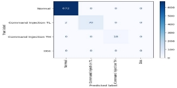

Figure 13: Confusion matrix  Random Forest [11]

4. **Dashboard Development**

The frontend dashboard has been designed using vanilla HTML, JavaScript, CSS, and jQuery. The technologies have been chosen for their simplicity, ease of use, as well as their widespread adaptation and support in the web development community.

Whilst for the backend, we chose express.js, due to its popularity and widely used as node.js framework. In addition, we have used MySQL for databases. Considering its being open-source, scale factor and performance wise DBMS.

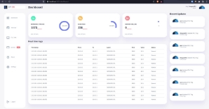

Figure 14: Admin Dashboard [11]

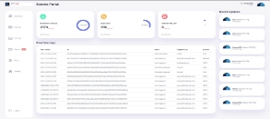

Figure 15: Events monitoring Page [11]

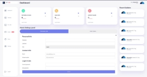

Figure 16: Admin settings portal [11]

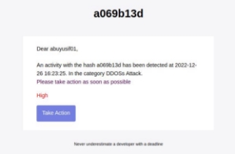

Figure 17: Notify email [11]

5. **Conclusion and Future works**

This research focused on creating an intrusion detection system for industrial control systems using supervised machine learning. The system was implemented with a front-end utilizing HTML, CSS, JavaScript, and jQuery, and a back-end using express.js and MySQL. The system demonstrated the ability to detect attacks in real time and send notifications to administrators.

Further testing and validation of the system are necessary to ensure accuracy and reliability. The system should also be implemented on a network and integrated with other security measures such as firewalls and antivirus software. Continuous improvement of the system, including regular updates and the incorporation of new technologies, will enhance its effectiveness in securing industrial control systems.

6. **References**
1. M. Eckhart and A. Ekelhart, “A specification based state replication approach for digital

twins,” ser. CPS-SPC ’18. New York, NY, USA: Association for Computing Machinery, 2018, p. 36–47. [Online]. Available: <https://doi.org/10.1145/3264888.3264892>

2. C. Gehrmann and M. Gunnarsson, “A digital twin based industrial automation and control system security architecture,” IEEE Transactions on Industrial Informatics, vol. 16, no. 1, pp. 669–680, 2020. DOI: 10.1109/TII.2019.2938885 [https://lup.lub.lu.se/search/files/81503765/IEEET ransIndInfGehrmannGunnarsson.pdf](https://lup.lub.lu.se/search/files/81503765/IEEETransIndInfGehrmannGunnarsson.pdf)
2. M. Dietz, M. Vielberth, and G. Pernul, “Integrating digital twin security simulations in the security operations center,” in Proceedings of the 15th International Conference on Availability, Reliability, and Security, ser. ARES ’20. New York, NY, USA: Association for Computing Machinery, 2020. DOI: 10.1145/3407023.3407039. ISBN 9781450388337. [Online]. Available: <https://doi.org/10.1145/3407023.3407039>
2. Varghese, S. A., Ghadim, A. D., Balador, A., Alimadadi, Z., & Papadimitratos, P. (2022, March). Digital Twin-based Intrusion Detection for Industrial Control Systems. In 2022 IEEE International Conference on Pervasive Computing and Communications Workshops and other Affiliated Events (PerCom Workshops) (pp. 611-617). IEEE. [http://kth.diva-portal.org/smash/get/diva2:16375 61/FULLTEXT01.pd](http://kth.diva-portal.org/smash/get/diva2:1637561/FULLTEXT01.pd)
2. Xu, Qinghua, Shaukat Ali, and Tao Yue. "Digital twin-based anomaly detection in cyber-physical systems." 2021 14th IEEE Conference on Software Testing, Verification and Validation (ICST). IEEE, 2021. [https://www.simulamet.no/sites/default/files/pu blications/files/digital_twin_icst_2_1.pdf](https://www.simulamet.no/sites/default/files/publications/files/digital_twin_icst_2_1.pdf)
2. Empl, P., Schlette, D., Zupfer, D., & Pernul, G. (2022, August). SOAR4IoT: Securing IoT Assets with Digital Twins. In Proceedings of the 17th International Conference on Availability, Reliability and Security (pp. 1-10).

[https://dl.acm.org/doi/abs/10.1145/3538969.353 8975](https://dl.acm.org/doi/abs/10.1145/3538969.3538975)

7. F. Akbarian, E. Fitzgerald and M. Kihl, "Intrusion Detection in Digital Twins for Industrial Control Systems," 2020 International Conference on Software, Telecommunications and Computer Networks (SoftCOM), 2020, pp. 1-6, doi: 10.23919/SoftCOM50211.2020.9238162. <https://ieeexplore.ieee.org/document/9238162>
7. Mininet creates a realistic virtual network, running real kernel, switch and application code, on a single machine (VM, cloud or native), in seconds, with a single command <http://mininet.org/>
7. Grinberg, M. (2018). Flask Web Development. O’reilly Media, Incorporated. <https://flask.palletsprojects.com/en/2.2.x/>
7. flasgger. (2022, August 23). flasgger/flasgger. GitHub. <https://github.com/flasgger/flasgger>
7. DTSS (2022, December, 1) dtss/dtss Github <https://github.com/abuyusif01/dtss>
7. Digital Ocean: Cloud hosting provider <https://www.digitalocean.com/>
7. Scikit-learn: Machine Learning in Python, Pedregosa et al., JMLR 12, pp <https://scikit-learn.org/stable/>
7. M. Zolanvari, M. A. Teixeira, L. Gupta, K. M. Khan, and R. Jain, “Machine learning-based network vulnerability analysis of industrial internet of things,” IEEE Internet of Things Journal, vol. 6, no. 4, pp. 6822–6834, 2019 [https://ieeexplore.ieee.org/stamp/stamp.jsp?arn umber=8693904](https://ieeexplore.ieee.org/stamp/stamp.jsp?arnumber=8693904)
7. Liu, K., Wang, J. Y., Wei, Q., Zhang, Z. Y., Sun, J., Ma, R. K., & Deng, R. L. (2021). HRPDF:

A Software-Based Heterogeneous Redundant Proactive Defense Framework for Programmable

Logic Controller. *Journal of Computer Science and Technology*, *36*(6), 1307-1324. [https://ink.library.smu.edu.sg/cgi/viewcontent.cgi? article=7927&context=sis_research](https://ink.library.smu.edu.sg/cgi/viewcontent.cgi?article=7927&context=sis_research)
